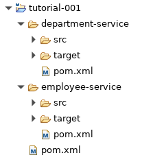

# Microservices Tutorial 001
## Getting Started with 2 Simple Rest-Services

##  The eclipse project
The eclipse project consist of the parent project and its 2 child modules or projects.



###  The parent project
The best way to have this structure is to let maven generate the projects executing by executing the following Maven goal: 
```
mvn archetype:generate -DgroupId=de.meziane.ms \ 
-DartifactId=tutorial-001 \
-DarchetypeGroupId=org.codehaus.mojo.archetypes \
-DarchetypeArtifactId=pom-root \
```
maven generates a simple pom under *tutorial-001* with:
```
  <packaging>pom</packaging>
``` 
This is where the configuration to be shared is located and eventually reused in child modules.
#### spring-boot-starter-parent as parent
To turn the modules into spring-bot applications, we have to add *spring-boot-starter-parent* as the parent of our parent project:
```
<parent>
  <groupId>org.springframework.boot</groupId>
  <artifactId>spring-boot-starter-parent</artifactId>
  <version>2.1.4.RELEASE</version>
  <relativePath /> <!-- lookup parent from repository -->
</parent>
```
#### The dependencies
The application needs the following dependencies:
 - spring-boot-starter-web 
 - spring-boot-starter-data-jpa
 - spring-boot-starter-data-jpa
 - h2
 - spring-boot-starter-test
#### The spring-boot-maven-plugin
We need also to add the *spring-boot-maven-plugin*:
```
<build>
  <plugins>
    <plugin>
      <groupId>org.springframework.boot</groupId>
      <artifactId>spring-boot-maven-plugin</artifactId>
    </plugin>
  </plugins>
</build>
```
### The child projects
To let Maven generate the child projects, we just need to execute:
For the department-service project:
```
mvn archetype:generate -DgroupId=de.meziane.ms 
-DartifactId=department-service 
-DarchetypeArtifactId=maven-archetype-quickstart 
-DinteractiveMode=false
```
and for the employee-service: 
```
mvn archetype:generate -DgroupId=de.meziane.ms \
-DartifactId=employee-service \
-DarchetypeArtifactId=maven-archetype-quickstart \
-DinteractiveMode=false
```
We are now ready to go.

## The restservices or trivial microservices
Let's start with 2 simple rest-services or trivial microservices, which retrieve data from a backend (a database for example), and which may communicate between them . 
### The department-service
The **department-service** is simple spring-boot application with a *RestCotroller* to deal with data about departments (retrieve departments with or without their respective employees, add a new, update or delete a department ..) . 
#### The DepartmentApplication
The *DepartmentApplication* is annotated with the usual annotation *@SpringBootApplication*: 
```
package de.meziane.ms;
...
@SpringBootApplication
public class DepartmentApplication {
  public static void main(String[] args) {
    SpringApplication.run(DepartmentApplication.class, args);
}
```
#### The Department domain class
This is a simple Java class annotated as *Entity*:
```
package de.meziane.ms.domain;
...
@Entity
public class Department {
  @javax.persistence.Id
  @GeneratedValue(strategy = GenerationType.AUTO)
  private Long Id;
  private String name;
  private String description;
  // The Getters and Setters
}
```
#### The DepartmentRepository
```
package de.meziane.ms.repository;
...
@Repository
public interface DepartmentRepository extends JpaRepository<Department, Long> {
	
}
```  
#### The DepartmentController
```
public class DepartmentController {

  @Autowired
  DepartmentRepository departmentRepository;	

  @GetMapping("/departments")
  public List<Department> findAll() {
    List<Department> depts = departmentRepository.findAll();
    return depts;
  }
	
  @GetMapping("/departments/{id}")
  public Department findById(@PathVariable Long id) {
    Department dept = departmentRepository.getOne(id); 
    return dept;
  }
}
```
#### The configuration file
Although not necesseary we add an application.properties file under *src/main/resources* with the following properties:
```
spring.application.name=department-service
server.port=8081
```
The application will be available under http://localhost:8081  
#### Populating the database at startup
As we are using an *in-memory* database, we want to have some data to play with. To this purpose we add a file *data.sql* under *src/main/resources*. Spring will pick it up and use it for populating the database. Here is the content of this file:
```
INSERT INTO department (id, name, description) VALUES
  (1L, 'Finances', 'Department s occupant de toutes les finances de l entreprise.' ),
  (2L, 'IT', 'Departement informatique.'),
  (3L, 'Personnel', 'Departement du Personel.'),
  (4L, 'relations éxterieures', 'Departement des relations éxterieures.')
;  
```
#### Accessing Data 
If we start the application as a Spring Boot Application, we can immediately access the end-points defined in the *DepartmentController*. 


### The employee-service
The **employee-service** is also a simple spring-boot application with a *RestCotroller* to deal with data about employees (retrieve employees, add a new, update or delete an employee ..). 

As the **employee-service** is identical to the **department-service**, we will not deal with its details.
We just note that this service will be available under  http://localhost:8081


## Summary 
We have 2 independant rest-services and we can access the related data through the defined end-points.
> Written with [StackEdit](https://stackedit.io/).
<!--stackedit_data:
eyJoaXN0b3J5IjpbLTExNTY3ODM3NjJdfQ==
-->